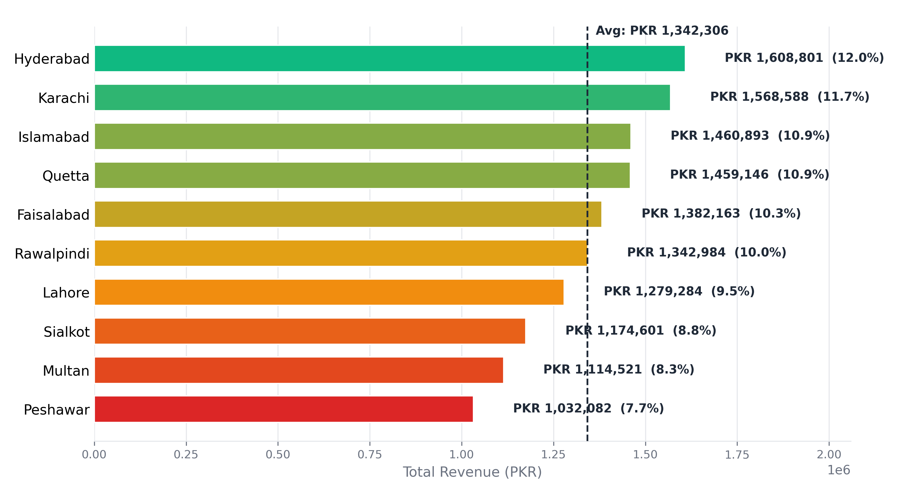
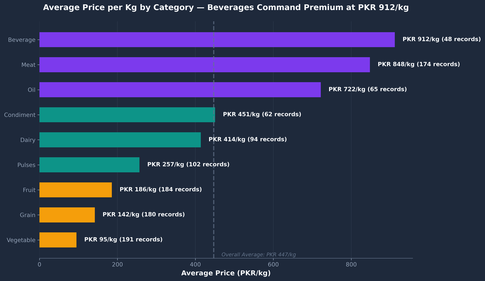
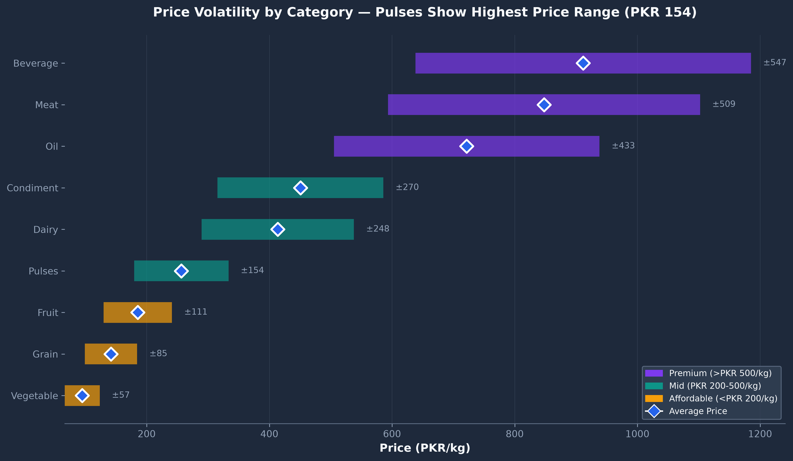
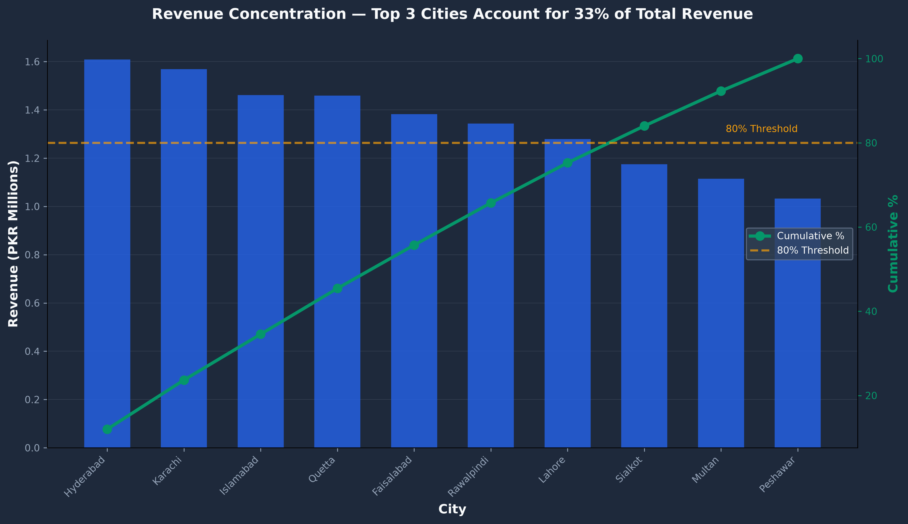
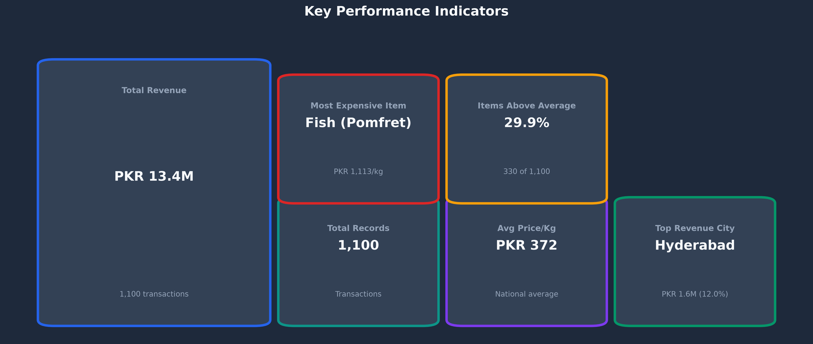

## Business Context

Food price volatility directly impacts household budgets, retail pricing strategies, and supply chain planning across Pakistan's urban markets. Procurement teams, policy makers, and retailers struggle with fragmented price data—unable to benchmark fair pricing, identify market anomalies, or make evidence-based expansion decisions.

This project addresses that gap by consolidating 1,100 price records from 10 major Pakistani cities into a structured analytical framework. The dashboard transforms raw market survey data into actionable insights that drive pricing strategy, supply chain optimization, and market expansion decisions.

The resulting insights help stakeholders understand where food commodities are overpriced or underpriced relative to national averages, which cities present the highest revenue potential, and which categories pose supply chain risk through price volatility.


## 🎯 **Who Benefits From This Analysis?**

| Stakeholder | Benefit | Key Question Answered |
|-------------|---------|----------------------|
| **Retail Procurement** | City-level pricing benchmarks for purchase orders | Which cities show highest/lowest pricing? Where should we buy? |
| **Supply Chain & Logistics** | Volatility metrics for inventory planning & hedging | Which categories have supply instability? What's our cost exposure? |
| **Sales & Expansion Teams** | Market sizing & revenue potential by geography | Which markets are under-served? Where should we expand? |
| **Policy & NGOs** | Food inflation indicators for social programs | Is price inflation uniform? Which categories need monitoring? |
| **Finance & Analysis** | Price dispersion insights for margin optimization | What's the pricing variance by region and category? |

---

## Design Approach

The dashboard follows executive briefing principles: KPI cards provide immediate situational awareness, city and category analyses are separated for focused decision-making, and visual hierarchy guides stakeholders from summary to detail.

---

## 📊 Visualizations

This project includes enhanced chart generation with business-oriented titles, consistent color schemes, and improved data visualization best practices.

### Revenue by City 
> **Business Question:** Which cities generate the most revenue?
> 
> **Key Insight:** Hyderabad leads at PKR 1.6M (12.0% share), while Peshawar generates the lowest revenue at PKR 1.0M (7.7% share). The chart uses a gradient color scheme from emerald (highest) to amber (lowest), enabling quick identification of top performers and underperforming markets.
> 
> **Strategic Implication:** 27% revenue spread across cities signals geographic pricing variance—either driven by logistics costs or market structure differences. Peshawar underperformance requires investigation: market gap or profitability gap?



### Average Price by Category — Horizontal Bar Chart



> **Business Question:** Which food categories are most expensive?
> 
> **Key Insight:** Beverages command the highest average price at PKR 912/kg, followed by Meat (PKR 848/kg) and Oil (PKR 722/kg). Vegetables are the most affordable at PKR 95/kg. The chart uses the same gradient scheme, highlighting pricing tiers for supply chain and retail strategy.
> 
> **Strategic Implication:** 10x price differential between premium (Beverages) and commodity (Vegetables) suggests distinct supply chains and margin profiles. Premium categories show pricing power; commodity categories show margin compression.

### Price Volatility by Category



> **Business Question:** Which categories have the most price instability?
> 
> **Key Insight:** Pulses show the highest price range (PKR 154), indicating significant market volatility. Premium categories (Beverages, Meat, Oil) show wider price ranges than affordable categories, reflecting supply chain complexity at premium tiers.
> 
> **Strategic Implication:** Pulses volatility signals supply shock risk—requires forward contracting or alternative sourcing. Vegetable stability indicates reliable supply but lower margins.

### Revenue Concentration — Pareto Analysis



> **Business Question:** What percentage of revenue comes from top cities?
> 
> **Key Insight:** Top 3 cities (Hyderabad, Karachi, Islamabad) account for 33% of total revenue, indicating moderate market concentration. The Pareto chart combines bar and line visualization to highlight the 80/20 principle in market structure—showing both absolute contribution and cumulative share.
> 
> **Strategic Implication:** 33% concentration suggests a balanced portfolio with meaningful opportunity in Tier-2 cities (Faisalabad, Rawalpindi, Lahore). Expansion strategy should target mid-tier cities, not just top metros.

### KPI Cards Layout



> **Design Approach:** Six KPI cards organized in a 3x2 grid with visual hierarchy — Total Revenue (primary), Total Records and Avg Price/Kg (secondary), and city/item metrics (tertiary). Each card includes color coding and status indicators for quick executive scanning.

---

## ✨ Features

- **Comprehensive Price Tracking** — 1,100 records across 10 cities and 35 food items
- **Interactive Dashboard** — KPI cards, revenue breakdowns, and category analysis
- **City-Level Analytics** — Revenue share, average prices, and performance status per city
- **Category Insights** — Price ranges, averages, and record counts for 9 food categories
- **Price Volatility Analysis** — Statistical analysis of price fluctuations across markets
- **Gap Analysis** — Identifies price disparities between cities and items
- **Price Classification** — Categorizes items into Low/Medium/High/Premium tiers
- **Monthly KPI Tracking** — Time-series monitoring of price and volume trends

---

## 🛠️ Technologies Used

| Technology | Purpose |
|------------|---------|
| Microsoft Excel | Data modeling, analysis, and dashboard development |
| Pivot Tables | Data aggregation and cross-tabulation |
| Advanced Charting | Bar charts, pie charts, and KPI visualizations |
| Conditional Formatting | Data highlighting and status indicators |
| Structured Data Modeling | Relational data organization and integrity |

---

## 🏆 Key Metrics

| Metric | Value |
|--------|-------|
| 📋 Total Records | 1,100 transactions |
| 💰 Total Revenue (PKR) | 13,423,064 |
| ⚖️ Avg Price / Kg | PKR 372 |
| 🏆 Top Revenue City | **Hyderabad** — PKR 1,608,801 |
| 🐟 Most Expensive Item | **Fish (Pomfret)** — PKR 1,113/kg avg |
| 📊 Items Priced Above Avg | 29.9% |

---

## 🏙️ Revenue by City (PKR)

| City | Total Revenue | % Share | Avg Price/Kg | Status |
|------|---------------|---------|--------------|--------|
| Hyderabad | 1,608,801 | 12.0% | 417.6 | 🏆 HIGHEST |
| Karachi | 1,568,588 | 11.7% | 421.0 | ✅ ACTIVE |
| Islamabad | 1,460,893 | 10.9% | 343.8 | ✅ ACTIVE |
| Quetta | 1,459,146 | 10.9% | 399.7 | ✅ ACTIVE |
| Faisalabad | 1,382,163 | 10.3% | 347.9 | ✅ ACTIVE |
| Rawalpindi | 1,342,984 | 10.0% | 409.4 | ✅ ACTIVE |
| Lahore | 1,279,284 | 9.5% | 349.4 | ✅ ACTIVE |
| Sialkot | 1,174,601 | 8.8% | 368.8 | ✅ ACTIVE |
| Multan | 1,114,521 | 8.3% | 325.3 | ✅ ACTIVE |
| Peshawar | 1,032,082 | 7.7% | 338.3 | ⚠️ LOWEST |
| **TOTAL** | **13,423,064** | **100%** | — | — |

---

## 🥩 Average Price by Category (PKR/Kg)

| Rank | Category | Avg Price/Kg | Max | Min | Records |
|------|----------|--------------|-----|-----|---------|
| 1 | Beverage | 911.6 | 1,185.1 | 638.1 | 48 |
| 2 | Meat | 847.8 | 1,102.1 | 593.5 | 174 |
| 3 | Oil | 721.7 | 938.1 | 505.2 | 65 |
| 4 | Condiment | 450.7 | 585.9 | 315.5 | 62 |
| 5 | Dairy | 413.8 | 537.9 | 289.7 | 94 |
| 6 | Pulses | 256.6 | 333.5 | 179.6 | 102 |
| 7 | Fruit | 185.6 | 241.3 | 129.9 | 184 |
| 8 | Grain | 141.9 | 184.5 | 99.3 | 180 |
| 9 | Vegetable | 94.9 | 123.4 | 66.5 | 191 |

---

## 💡 Key Discoveries & Strategic Implications

### **1. Geographic Price Variance (27% Range)**
- **Finding:** Avg price/kg ranges from PKR 325 (Multan) to PKR 421 (Karachi)
- **Question:** Cost to move goods or market structure effect?
- **Implication:** Impacts margin models; may justify regional pricing strategies or supply chain optimization

### **2. Beverage Premium (10x Vegetable Price)**
- **Finding:** Beverages (PKR 912/kg) vs. Vegetables (PKR 95/kg)
- **Question:** Luxury elasticity opportunity? Can premium categories sustain markup?
- **Implication:** Distinct pricing strategy needed by category tier; premium categories show higher margin potential

### **3. Peshawar Underperformance (7.7% Share, Lowest Avg)**
- **Finding:** Lowest total revenue AND lowest average price per kg
- **Question:** Market gap (under-served) or profitability gap (unprofitable market)?
- **Implication:** Requires qualitative follow-up—expansion opportunity or market to avoid?

### **4. Pulses Volatility as Supply Risk (PKR 154 Range)**
- **Finding:** Pulses show highest price fluctuation; Vegetables stable
- **Question:** Supply shock indicator? Seasonal or structural volatility?
- **Implication:** Risk management signal; consider forward contracting for volatile categories; leverage stable categories for consistent margin

### **5. Price Dispersion (29.9% Above Average)**
- **Finding:** Nearly 1/3 of items priced above national average
- **Question:** Is this market norm or pricing inefficiency?
- **Implication:** Opportunity for gap analysis—identify items priced significantly above/below peers for arbitrage or cost reduction

---

## 🔮 Future Improvements

- [ ] Automate data ingestion from market survey sources
- [ ] Add interactive slicers for dynamic filtering by city, category, and date range
- [ ] Integrate Power BI for enhanced visualization capabilities
- [ ] Implement price forecasting using historical trends
- [ ] Add comparative analysis with regional and international markets
- [ ] Create automated report generation with executive summaries
- [ ] Build a web-based dashboard using Python (Streamlit/Dash) for broader accessibility
- [ ] Incorporate inflation-adjusted price trends over multiple years
- [ ] **Expand stakeholder analysis:** Quantify impact for each user group (retail, supply chain, policy)
- [ ] **Add margin modeling:** Layer cost + logistics data to show profitability by city/category

---

## 📚 Learning Outcomes

- **Excel Advanced Features** — Pivot tables, Power Query, and advanced charting techniques
- **Data Cleaning & Transformation** — Raw survey data handling, format normalization, and inconsistency resolution
- **Dashboard Design** — Professional dark-themed dashboards with KPI scorecards and visual hierarchies
- **Statistical Analysis** — Averages, volatility metrics, and price distributions across large datasets
- **Business Intelligence** — Translating raw data into actionable market insights for decision-making
- **Data Storytelling** — Presenting complex analytics in clear, visual formats for non-technical stakeholders
- **Business Analysis Fundamentals** — Stakeholder mapping, business question formulation, and strategic implication extraction

---

## 👤 Author

**Innocent Watsala**

- 🌍 Based in United Arab Emirates
- 📊 Data Analyst specializing in Excel, SQL, and Python
- 🎯 Focused on data cleaning, EDA, and business intelligence
- 💼 Career Goal: Business Analyst — bridging data and strategy

### Connect

[](https://linkedin.com/in/YOUR-LINKEDIN-HERE)
[](mailto:watsala.digital@gmail.com)
[](https://github.com/INNOCENT256-UG)

---

## 💻 Usage

### Viewing the Dashboard
1. Open `PK_FOOD_PRICE_PER_KG-project1.xlsx`
2. Navigate to the "Dashboard" sheet
3. Interact with pivot tables and charts to explore data

### Exploring Analysis Files
- **City Coverage Performance** — Review city-by-city revenue and status
- **Monthly KPI Tracker** — Track price trends over time
- **Gap Analysis** — Identify pricing inefficiencies across markets
- **Price Volatility** — Analyze statistical price fluctuations
- **Price Level** — View item classifications by price tier

### Data Refresh
- Source data is in `Source_Market_Survey_PK.xlsx`
- Update the core dataset and refresh pivot tables to incorporate new data
- Inspired by real-world food price monitoring systems used by government and NGOs

---

## 📄 License

This project is licensed under the MIT License — feel free to use and modify for your own portfolio or learning purposes.

---

## 🙏 Acknowledgments

- Data sourced from Pakistan market surveys and ground-level price collections
- Built as a portfolio project demonstrating Excel analytics and dashboard design capabilities
- Part of a larger analyst portfolio showcasing progression from descriptive → predictive analytics

---

## 📁 Project Structure

```
📁 Excel_Analytics/
│
├── 📊 PK_FOOD_PRICE_PER_KG-project1.xlsx     ← Core dataset (1,100 records)
├── 📊 Source_Market_Survey_PK.xlsx           ← Raw market survey data
│
├── 📈 chart_data.xlsx                        ← Chart source data
├── 📈 City_Coverage_Performance.xlsx         ← City-level performance metrics
├── 📈 Monthly_KPI_tracker.xlsx               ← Monthly KPI tracking
│
├── 🔍 gap_Analysis.xlsx                      ← Price gap & market gap analysis
├── 🔍 Price_Level.xlsx                       ← Price level classification
├── 🔍 Price_Review_per_Kg.xlsx               ← Per-kg price review breakdown
├── 🔍 Volatility_of_price_in_PK_FOOD_PRICE.xlsx ← Price volatility analysis
│
├── 🖼️ Chart_Revenue_by_City_v2.png           ← Revenue analysis visualization
├── 🖼️ Chart_Price_by_Category_v2.png         ← Category pricing visualization
├── 🖼️ Chart_Price_Volatility_v2.png          ← Price stability analysis
├── 🖼️ Chart_Revenue_Concentration_v2.png     ← Pareto distribution chart
├── 🖼️ Chart_KPI_Cards_v2.png                 ← Executive KPI dashboard
│
└── 📄 README.md                              ← Project documentation
```

---

**⭐ Ready to expand your portfolio? Check out my other projects:**
- [SFO Air Traffic & Cargo Analysis](https://github.com/INNOCENT256-UG/-SFO-Air-Traffic-Cargo-Statistics-Data-Analysis-Project) — 26 years of operational logistics data
- [Telco Customer Churn Analysis](https://github.com/INNOCENT256-UG/WA_Fn-UseC_-Telco-Customer-Churn) — Predictive modeling for retention
- [Titanic Survival Analysis](https://github.com/INNOCENT256-UG/TITANIC_DATA_ANALYSIS) — Machine learning classification

